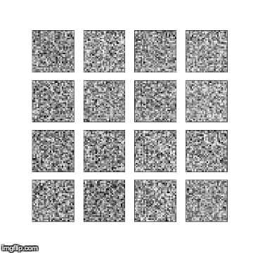

# ML_Project

# Generative Adverserarial Networks

In this project, I am tring to implement [Generative Adverserarial Nets (GAN)](https://arxiv.org/pdf/1710.07035.pdf) for digit and Face generation. GAN's are very exciting algorithms and used today from generating celebrity faces, generating artisting images to generate audio signals. 

# Dataset

- Digit Dataset : I have used MNIST dataset for digit generation.
- Face dataset : I used FaceDaset from news articles which is available with sklearn.

# Preprocessing

- During preprocessing, I only used 5 percent of each class in training set for digit class. It was taking long time to train on CPU with large data set. 
- I also used subset of the Face Data set for face generation.

# Model 
- I have used multi layer network for both digit and face generation. Both generator and discriminator are using deep linear networks for training. 
- The results can be improved with CNN's and more deeper networks.

# code
The code for training digits and Face is available [here](./code).

# Main Functions

The main the functions inside the code are [**runAdversialNet**](./code/Generative Adversial Nets-Digit.ipynb) which take care of following facts which are important to train GAN.
- Discriminator model take both real and fake samples in each batch.
- Generative samples mark samples as Real to fool the discriminator and learn from mistakes.
- Make sure where the discriminator models layers are training and where not.

The another main code to look at is how models are created and how generator concatnate discriminator for tranining. This is shown is **Model Generation** Sections of notebook

# Results

- For checking that generator is able to learn distribution we plot the results of generator which takes noise as input and generate different digits/faces. 
- We also plot loss with epoch which shows that both generator and discriminator is having same loss which meand didscriminator is not able to differentiate that images are real or fake. With more data for training the results can improve.

# Digit Generation 
I got the following results while using different learning rates for training. 

- The following image shows how the training improves as the epochs are increasing at learning 1e-4.

- The following image shows how the training improves as the epochs are increasing at learning rate 1e-4.

- The loss with epochs for both generator and discriminator.

- The results here can be improved with more epochs of training and if we include the complete MNIST dataset for training.
- I only used linear networks for training but It can be improved if we can use CNN's.

# Face Generation

- The following image shows the results when we use same kind of network for face dataset.

- The loss with epochs for both generator and discriminator.

- The results shows that it was generative network was able to capture the original distribution and improves with epoch 
but results are not very clean because dataset was small and was not to run multiple times due to GPU limitation.
- The results here can be improved with more epochs of training and if we include the complete Face dataset for training.
- I only used linear networks for training but It can be improved if we can use CNN's.

# Conclusion
- It is very interesting that small linear networks can able to capture original data distribution.
- **It took me long time to fine tune hyper parameters for training both generator and discriminator.**
- **The process should have been faster if I had GPU with me.**
